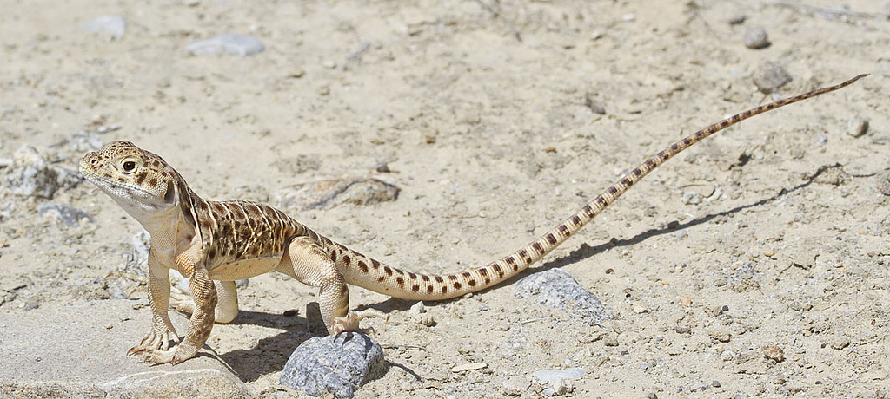

---
title:
author: "cjlortie & taylor noble"
date: "nov 2016 to june 2017"
output:
  html_document:
    theme: yeti
    toc: yes
    toc_depth: 3
    toc_float: yes
  pdf_document:
    toc: yes
---
#Telemetry analytics of blunt-nosed leopard lizards
###Purpose
To use telemetry to examine Gambelia sila frequency of shrub use within a desert ecosystem.




[ecoblender](http://ecoblender.org)

###Methods
A total of 30 lizards were instrumented in the Carrizo National Monument by Taylor Noble and Mike Westphal. Individual animals were monitored for relocation patterns, georeferenced, and detailed observation applied to a subset of animals. Note: all telemetry work was done at site #4 in both years.


```{r, library, warnings = FALSE, message=FALSE, echo=FALSE}
#library loads####
#wrangling
library(tidyverse)

#packages <- c("rgdal", "maps", "multcomp", "nnet", "adehabitatHR", "raster", "maptools", "leaflet")

#basic maps
library(rgdal)
library(maps)

#models & posthoc tests
library(multcomp)
library(nnet) #package to run a multinomial linear regression

#habitat
library(adehabitatHR)
library(raster) 
library(rgdal)
library(maptools)
```

###Primary data
```{r, data}
#load & wrangle data####
data <- read_csv("data/telemetry.relocations.csv")
library(hms)
data$time <- as.hms(data$time)
data
#data <- data %>% mutate(day.time = if(data$time >= 12) { 
  #print("PM")} else {print("AM")
    #})
#data <- data %>% filter(behavior != "avoiding.predators")
data$behavior <- gsub("standing", "underground", data$behavior)

#wrangle in gender of lizards here
lizards <- read_csv("data/lizards.2016.csv")
lizards <- lizards %>% dplyr::select(lizard, gender, mass, length.mm)
lizards <- lizards %>% filter(gender != "uk")

data <- left_join(data, lizards, by = "lizard")  

#the 'data' dataframe = a data structure model with every relocation as sample unit - this has non-independence/pseudoreplication issues if used directly in statistical models without nesting variables and careful statistical model builds.

#wrangle for appropriate simplified data structures####
#population-level data structure####
#data structure models habitat & time as sample units with no non-independence issues
pop.data <-data %>% group_by(mesohabitat, microhabitat.simple, time.class, behavior) %>% count(behavior)
pop.data #n equals number of days by am/pm (77).

#pop-data with gender
pop.data.gen <-data %>% 
  group_by(gender, mesohabitat, microhabitat.simple, time.class, behavior) %>% 
  count(behavior)
pop.data.gen #n equals number of days by am/pm (77).

#lizard-level data structure####
#data structure models individual lizards as sample unit
lizard.data <- data %>% group_by(lizard, gender, mesohabitat, microhabitat.simple, time.class, behavior) %>% count(behavior)
lizard.data #n equals each lizard in every habitat scale by time so time and space not fully independently sampled but each lizard is sample unit with repeated measures (396).

#lizard-level weighted frequencies could be added here too
#sum up total relocations per lizard by mesohabitat (n) then divide the shrub/open totals by N.
lizard.freq <- lizard.data %>% 
  group_by(lizard, gender, mesohabitat) %>% 
  summarise(total.relocations = sum(n))

lizard.totals <- lizard.data %>% 
  group_by(lizard, gender) %>% 
  summarize(totals = sum(n)) %>% dplyr::select(-gender)

lizard.freq <- left_join(lizard.freq, lizard.totals, by = "lizard") %>% mutate(proportionate.association = total.relocations/totals)

#timing####
timing <- data %>% group_by(date, time.block, behavior) %>% count()
#timing

lizard.sampling <- data %>% 
  group_by(lizard, date) %>% count() %>% summarize(count = sum(n))
lizard.sampling
summary(lizard.sampling)
length(unique(lizard.sampling$lizard))

lizard.days <- lizard.sampling %>% group_by(lizard) %>% count()
lizard.days
summary(lizard.days)
greater.than.5 <- lizard.days %>%
  mutate(threshold = case_when(n < 5 ~ 0, n >=5 ~ 1))

sum(greater.than.5$threshold)

greater.than.0 <- lizard.days %>%
  mutate(threshold = case_when(n < 1 ~ 0, n >= 1 ~ 1))
sum(greater.than.0$threshold)

days <- lizard.sampling %>% 
  group_by(date) %>%
  count()
days
summary(days)

#distributions####
#require(fitdistrplus)

#pop data structure
#plotdist(counts$n)
#descdist(counts$n, boot = 1000)
#fit.p <- fitdist(counts$n, "pois")
#summary(fit.p)

#individual data structure
#plotdist(lizards$n)
#descdist(lizards$n, boot = 1000)
#fit.p <- fitdist(lizards$n, "pois")
#summary(fit.p)
```

###Maps
```{r, map, warnings = FALSE, message=FALSE}
#world<-map_data("county", "california")
#map<-ggplot() + geom_polygon(data=world, colour="gray50", fill="gray50", aes(x=long, y=lat, group=group)) + 
  #xlab("Longitude") +
  #ylab("Latitude")
  #map + geom_point(data=data, aes(x=long, y=lat), #color="green")
  
#ggmap
require(ggmap)
cali <- get_map(location = c(lon = -119.6, lat = 35.11), zoom = 13)
#cali <-get_googlemap("california", crop= FALSE, zoom = 10)
p <-ggmap(cali)
p + geom_point(data=data, aes(x=long, y=lat, color = time.class), alpha = .25, size = 0.5) + scale_color_brewer(type = 'seq', palette = "Dark2")

#interactive map####
library(leaflet)
t.class <- colorFactor("Blues", data$time.class, levels = TRUE)

m <- leaflet() %>%
  addTiles() %>%  
  addCircleMarkers(data$long, data$lat, radius = 1, popup = data$behavior, color = ifelse(data$time.class == "AM", 'blue', 'red'))
m

```

###Habitat: pop-data structure viz
```{r, pop.data viz, warnings = FALSE, message=FALSE}
#viz using pop count data####
ggplot(pop.data, aes(mesohabitat, n, fill = behavior)) +
  geom_boxplot() +
  facet_grid(~time.class) + 
  scale_fill_brewer(palette = "Greens") +
  xlab("mesohabitat") +
  coord_flip()  

```

###Habitat: pop-data structure models
```{r, pop.data stats model, warning=FALSE, message=FALSE}
#The purpose is not to actually study behavior in this paper but report and test where they are found more frequently and by what time of day.

#Note: counts data are aggregated with sample unit as the day. This data structure does not have pseudoreplication issues because we are testing the entire population of lizards every day, not individual lizards.

summary.pop <- pop.data %>% 
  group_by(mesohabitat) %>% 
  summarize(mean = mean(n), sd = sd(n))
summary.pop

#Count dataframe structure fit to models####
#mesohabitat
m <- glm(n~mesohabitat*time.class, family = 'poisson', data = pop.data) #also tested glmer with time as random effect, same outcome
#summary(m)
anova(m, test = "Chisq")

#posthoc test
require(lsmeans)
lsmeans(m, pairwise~mesohabitat*time.class, adjust="tukey")
lsmeans(m, pairwise~mesohabitat, adjust="tukey")

```

###Behavior: individual-data structure models
```{r, lizard.data structure, warning=FALSE, echo=FALSE}
#Behavior choices####
#use the 'behavior' vector and multinomial linear regression on mesohabitat
data$behavior <- relevel(as.factor(data$behavior), ref = "underground")
m <- multinom(behavior~mesohabitat*time.class, data = data)
summary(m)
z <- summary(m)$coefficients/summary(m)$standard.errors
z
p <- (1 - pnorm(abs(z), 0, 1))*2
p

```

###Relocations: home-range models
```{r, home-range analytics, message=FALSE, warning = FALSE, error=TRUE}
#convert to UTM and set units to m
track.pop <-data
track.pop <- track.pop %>% filter(lizard != "x") #were not 5 relocations for x
coordinates(track.pop) <- ~long+lat
proj4string(track.pop) <- CRS("+proj=longlat") #assign projection and coordinate reference system
track.pop <- spTransform(track.pop, CRS("+proj=utm +zone=10")) #transform

#Minimum Convex Polygon####
#Population
mcp.pop <- adehabitatHR::mcp(track.pop, percent=95, unin = c("m"), unout = c("km2")) #unout is units out
mcp.pop
as.data.frame(mcp.pop)

#Individuals
mcp.ind <- mcp(track.pop[,1], percent=95, unin = c("m"), unout = c("m")) #adding the [,1] tells it the ID and then does individually instead of collectively.
#mcp.pop <- mcp(track.pop[,1], percent=95, unin = c("km"), unout = c("km")) 
mcp.ind #total area each lizard occupies
as.data.frame(mcp.ind)

        
#MCP Area####
#Population
mcp.area <- mcp.area(track.pop, percent = seq(20,100, by = 5), unin = c("m"), unout = c("km2"), plotit = FALSE)
mcp.area
as.data.frame(mcp.area)
mcp.area <- mcp.area %>% mutate(step=seq(20,100, 5))
summary(mcp.area) #mean hr size for all lizards tracked

#Individual
mcp.area.ind <- mcp.area(track.pop[,1], percent = seq(20,100, by = 5), unin = c("m"), unout = c("km2"), plotit = FALSE)
mcp.area.ind #curves
as.data.frame(mcp.area.ind)

individuals <- mcp.area.ind %>% mutate(step=seq(20,100, 5))
individuals <- as_tibble(individuals)
individuals <- individuals %>% gather(c(1:28), key = "individual", value = "mcp.area")
individuals <- individuals %>% 
  rename(lizard = individual)
individuals <- left_join(individuals, lizards, by = "lizard")  
individuals <- individuals %>% 
  na.omit(gender) %>% mutate(area.ha = mcp.area*100)
area.summary <- individuals %>%
  group_by(gender) %>%
  filter(step == 100) %>%
  summarise(mean.ha = mean(area.ha), se = sd(area.ha)/sqrt(length(area.ha)))
area.summary

max.area <- individuals %>%
  filter(step == 100)
m <- glm(area.ha~gender + mass, family = gaussian, max.area)
anova(m, test = "Chisq")

t.test(max.area$area.ha~max.area$gender)

m <- glm(area.ha~gender*mass, family = gaussian, max.area)
anova(m, test = "Chisq")
summary(lm(area.ha~mass + gender, data = max.area))

#generalized models for home-range differences####
mcp.data <- read_csv("data/mcp.2016.overlap.csv")
mcp.data <- mcp.data %>%
  filter(gender != "uk")

#gender
m <- glm(area ~ gender, data = mcp.data)
m
anova(m, test = "Chisq")

mcp.data.m <- mcp.data %>% 
  filter(gender == "m")

mcp.data.f <- mcp.data %>% 
  filter(gender == "f")

#extent of overlap
#all individuals
t.test(mcp.data$polygons.overlapping, mu = 0)
t.test(mcp.data$polygons.overlapping, mu = 1)
t.test(mcp.data$polygons.overlapping, mu = 2)

#by gender
t.test(mcp.data.m$polygons.overlapping, mu = 0)
t.test(mcp.data.m$polygons.overlapping, mu = 1)
t.test(mcp.data.m$polygons.overlapping, mu = 2)

t.test(mcp.data.f$polygons.overlapping, mu = 0)
t.test(mcp.data.f$polygons.overlapping, mu = 1)
t.test(mcp.data.f$polygons.overlapping, mu = 2)

#likelihood
m <- glm(mcp.overlap~gender + area, family = binomial, data = mcp.data)
m
anova(m, test = "Chisq")

#number of overlapping polygons
m <- glm(polygons.overlapping~gender + area, family = poisson, data = mcp.data)
m
anova(m, test = "Chisq")


```

###Shrub density: individual-data structure
```{r, freq, warning=FALSE, message=FALSE}
#dataframe with manual counts using Google Earth for each MCP polygon associated with an individual relocated lizard
individual.data <- read.csv("data/individuals.csv")

#frequency data for mesohabitat patterns
lizard.freq <- na.exclude(lizard.freq)
lizard.freq <- lizard.data %>% 
  group_by(lizard, gender, mesohabitat, time.class) %>% 
  summarise(total.relocations = sum(n))

lizard.totals <- lizard.data %>% 
  group_by(lizard, gender) %>% 
  summarize(totals = sum(n)) %>% dplyr::select(-gender)

lizard.freq <- left_join(lizard.freq, lizard.totals, by = "lizard") %>% mutate(proportionate.association = total.relocations/totals)

lizard.freq <- na.exclude(lizard.freq)
#density by associations####
lizard.freq <- left_join(lizard.freq, individual.data, by = "lizard")

ggplot(lizard.freq, aes(shrub.density, proportionate.association, color = mesohabitat)) + 
  geom_point() +
  geom_smooth(se = FALSE, method = lm) +
  labs(y = "weighted associations", x = "shrub density")+ 
  scale_color_brewer(palette = "Paired")

#global glm
m <- glm(proportionate.association~shrub.density*gender*mesohabitat, family = quasibinomial, data = lizard.freq)
anova(m, test = "Chisq") 
summary(m)

#for each fit
lizards.open <- lizard.freq %>% dplyr::filter(mesohabitat == "open")
m <- lm(proportionate.association~shrub.density, data = lizards.open)
summary(m)


lizards.shrub <- lizard.freq %>% dplyr::filter(mesohabitat == "shrub")
m <- lm(proportionate.association~shrub.density, data = lizards.shrub)
summary(m)

```
